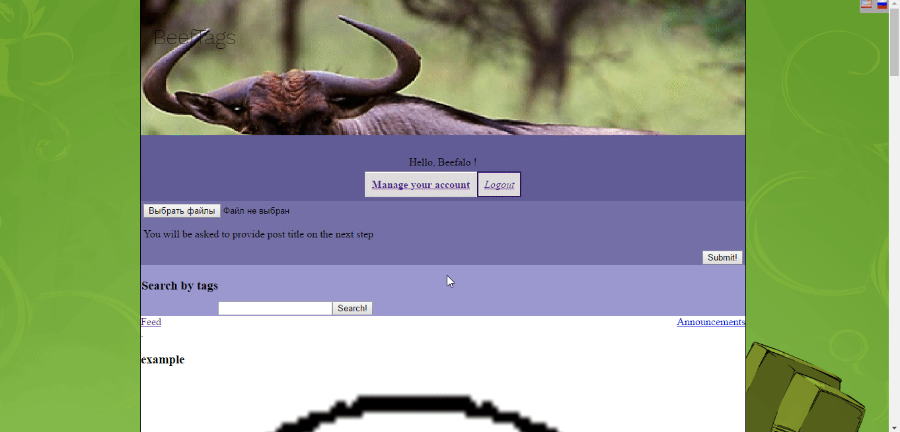

# BeefTags CMS
BeefTags is a simple blog CMS that supports uploading pictures to livefeed.
# About:

##### Upload pictures with options like:
* Post title
* Original author 
and
* Tags, so that your post can be found using easy search.
## Have a good expirience as user:
### Comment:

Comment and like posts, as you would on any other social network! Yes, you can use emojis.
### Manage your account:

You can change your avatar and password here.
## Feel the power of admin:
### Remove unwanted posts in less then a scecond:

That is it, just click the ```X``` button
# Demo:
Can be seen on http://beeftags.rf.gd/
# Install:
You can download a release as zip than unzip it at server. You have two ways, but now only one is suuported.
Here is step-by-step instruction:
## Direct way:
1. Download release
1. Upload to your server
1. Unzip it
1. Edit the ```passwords.db``` if nescessary, by default admin password is ```admin```
1. Login to admin
1. Login to /control and edit settings
1.That's it you've done it!
> Please notice, this software heve been tested on the CentOS 7 (x64) on free, shared hosting.
#### Performance:
> Average script execution time is ```172ms``` (index page)
> ```94ms``` (post page)
> ```118ms``` (comment, upload, delete post)
